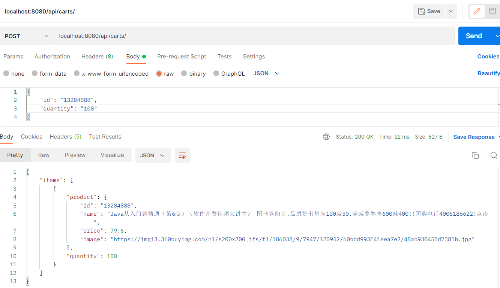
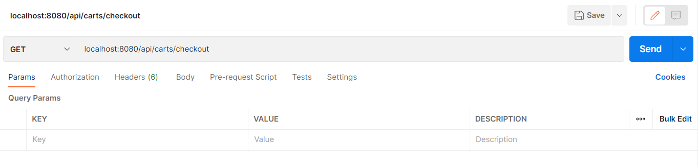
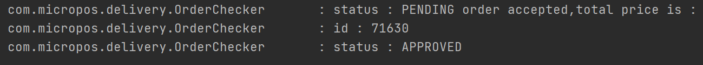
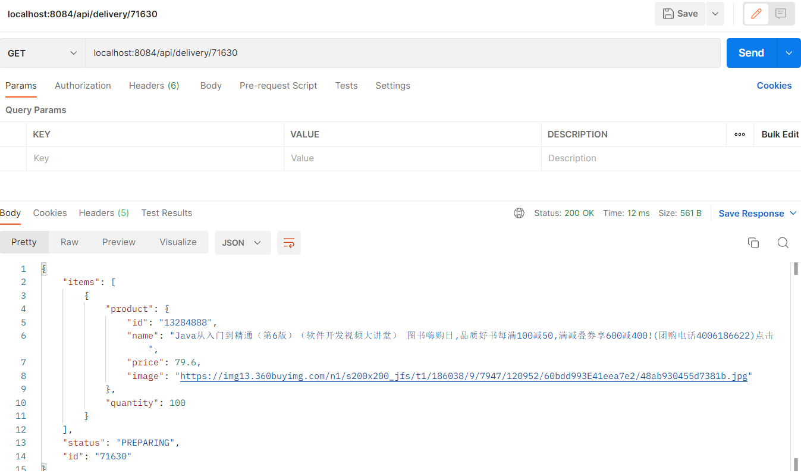
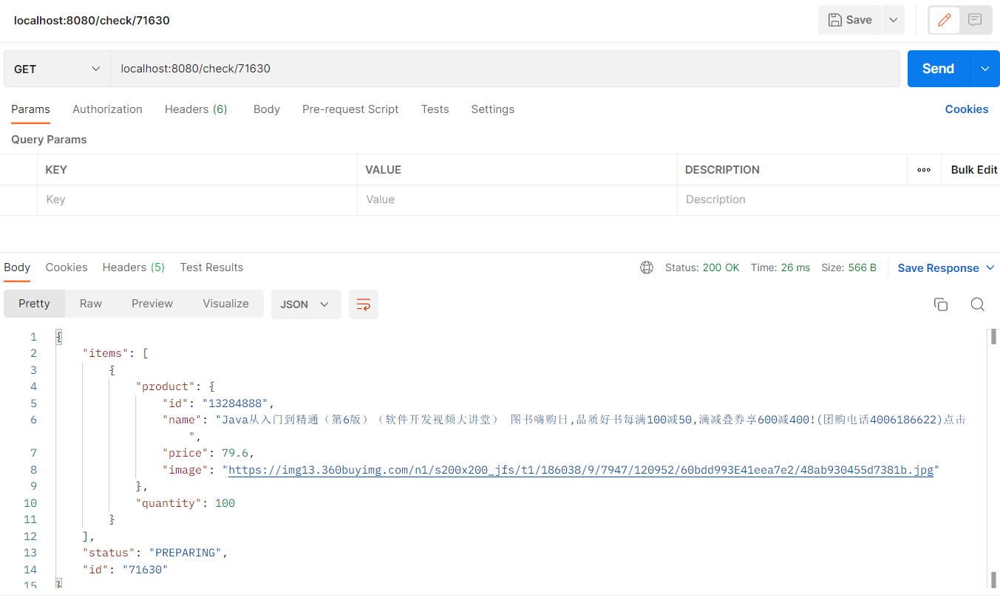

1. 通过post添加商品至购物车

   

2. checkout结算，生成order

   

3. 由order生成delivery，id为71630

4. 通过直接访问delivery service（8084端口），获取delivery信息

   

包含了商品信息，状态，id

5. 使用Spring integration，从gateway（8080）获取delivery信息

---

